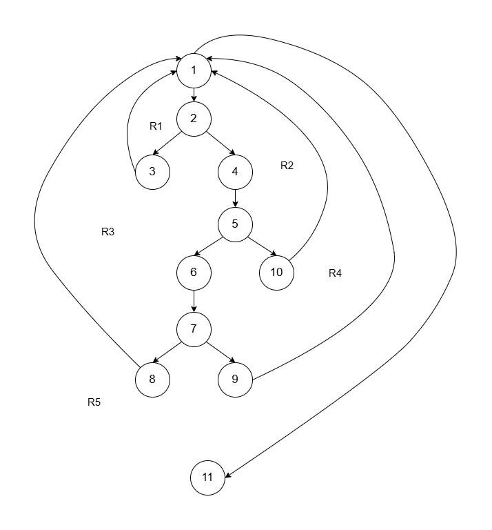

# Path Analysis: Stock Update Functionality

> **Catatan:** Ini adalah analisis manual terhadap logika program, bukan hasil automated coverage tool. Analisis dilakukan dengan membaca kode sumber dan mengidentifikasi jalur eksekusi secara manual.

---

## Informasi Pengujian

**Functionality:** Update menu stock after order placement  
**File:** `CheckoutActivity.java`  
**Technique:** Basis Path Testing (Manual)  
**Period:** Juni 2025

---

## Deskripsi Functionality

Fungsi ini memperbarui stok menu di database setelah order berhasil ditempatkan. Sistem melakukan iterasi pada setiap item yang dipesan dan mengurangi stok di Firebase Realtime Database.

---

## Path Analysis

### Complexity Calculation

Menggunakan formula Cyclomatic Complexity untuk mengidentifikasi jumlah jalur independen:

```
V(G) = E - N + 2
Dimana E = edges, N = nodes

V(G) = 14 - 11 + 2 = 5
```

**Hasil:** Terdapat **5 jalur eksekusi independen** yang perlu diuji.

### Flow Diagram



---

## Test Scenarios

Berdasarkan analisis path, diidentifikasi 5 skenario yang perlu diuji:

| Scenario | Condition | Expected Behavior |
|----------|-----------|-------------------|
| **1** | Order list kosong | Fungsi selesai tanpa aksi |
| **2** | Item tanpa ID menu | Skip item, log warning |
| **3** | Database connection error | Log error, lanjut ke item berikutnya |
| **4** | Stock value tidak ditemukan | Log warning, skip update |
| **5** | Stock update berhasil | Stock berkurang sesuai quantity |

---

## Test Execution

| Scenario | Test Data | Result | Status |
|----------|-----------|--------|--------|
| 1 | Empty list | Sesuai expected | PASS |
| 2 | menuId = null | Warning logged | PASS |
| 3 | Firebase offline | Error logged | PASS |
| 4 | Stock field = null | Warning logged | PASS |
| 5 | Stock = 10, order = 2 | Stock menjadi 8 | PASS |

**Path Coverage:** 100% (5/5 scenarios tested)

---

## Findings

### Positive Observations
- Fungsi menangani error dengan baik (null values, connection failures)
- Stock tidak bisa menjadi negatif (defensive logic)
- Logging memadai untuk debugging

### Technical Notes
- Stock update yang berhasil tidak di-log
- Tidak ada rollback mechanism jika salah satu item gagal
- Potensi race condition pada multiple concurrent orders

### Defects
**Tidak ada defect kritis ditemukan** dalam scope pengujian ini.

---

## Conclusion

Berdasarkan path analysis manual, fungsi stock update berjalan sesuai logika yang diharapkan untuk semua skenario yang diidentifikasi. Error handling sudah baik untuk kondisi null dan connection failure.

**Catatan:** Analisis ini fokus pada path coverage dari logika program dan tidak mencakup testing untuk concurrency, transaction handling, atau load scenarios.
**Period:** Juni 2025
